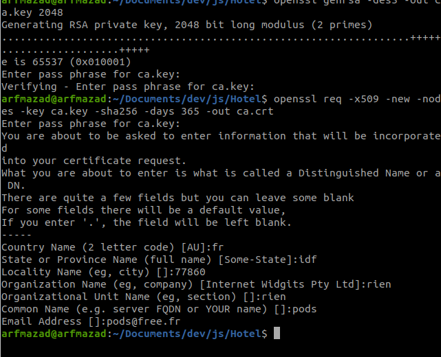
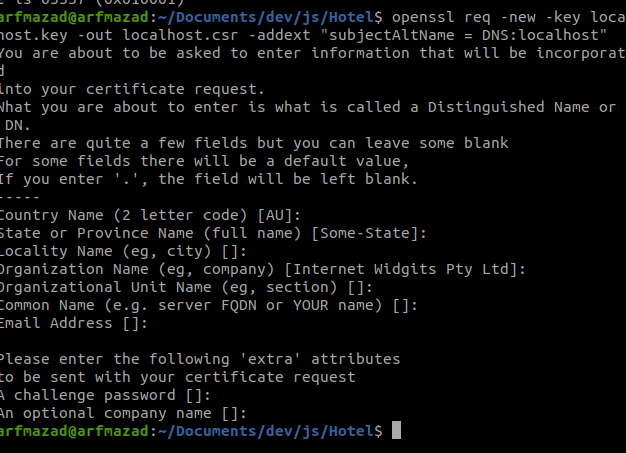

https://davegebler.com/post/node-js/https-server-in-five-minutes-with-node-js

```sh
openssl genrsa -des3 -out ca.key 2048
# when prompted, enter a passphrase of your choosing

openssl req -x509 -new -nodes -key ca.key -sha256 -days 365 -out ca.crtopenssl req -x509 -new -nodes -key ca.key -sha256 -days 365 -out ca.crt
# when prompted, enter the passphrase from step 1
# Then enter whatever you like for the other prompts or leave as blank/defaults

openssl genrsa -out localhost.key 2048
openssl req -new -key localhost.key -out localhost.csr -addext "subjectAltName = DNS:localhost"
# Again when prompted, enter some sensible values or just leave blank
```





```sh
openssl x509 -req -in localhost.csr -CA ca.crt -CAkey ca.key -CAcreateserial -out localhost.crt -days 365 -sha256 -extfile localhost.ext
# When prompted, enter your passphrase from step 1

Y
```

# solution 2

https://stackoverflow.com/questions/22584268/node-js-https-pem-error-routinespem-read-biono-start-line

openssl req -newkey rsa:2048 -new -nodes -keyout key.pem -out csr.pem
openssl x509 -req -days 365 -in csr.pem -signkey key.pem -out server.crt
# Hotel
# Hotel
